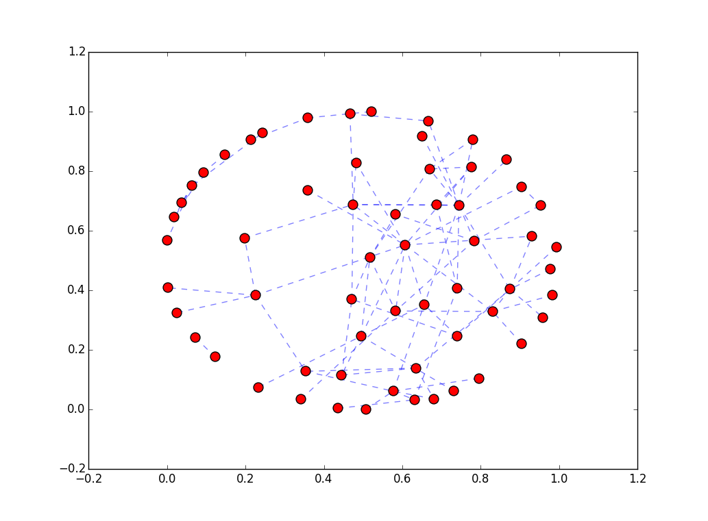

# Automated Decision System Final Project
## Theo: Siri with a fashion sense

For my final project I implemented a system that recommends new clothing items based on what the user has in her cart.

###Overview
The user will see a feed of items sampled randomly from the database. When the user selects one item, it will be added to the cart on the right.
The feed is created using infinite scroll that updates with items from the database as the user scrolls down. Check out the final live project [here](http://www.theo.clothing)

###Architecture
This project uses a [ReactJS](https://facebook.github.io/react/) framework. This keeps the page well-structured. React utilizes components, where components propagate data to their child components. The uni-directional data flow structure of React re-renders all components when the data store changes. Children of components will update as the data propagates. Take a look at user.js for my implementation of React.

The React framework makes it easy to implement the shopping cart. When a Panel is selected, a callback sends a dispatcher to the data store. This action then propagates the new list of cart items to the top container's children, which includes the Cart component. You can also click on the Cart's components, which will similarly send a dispatcher to the top and update the data store.

###Recommendations
I created a knowledge database, based on the subjective input of an "expert", that inform the recommendation algorithm. I use [Parse](http://parse.com) for Theo's database. I utilize Parse's REST API to upload objects to the database using python (look at [upload.py](./upload.py)). This database stores items as nodes in a graph. The edges indicate other items that "go well" with this item. These matches are determined by experts, using the [expert portal](www.theo.clothing/expert). The edges are actually weighted, and the weight comes from the number of times two items were determined to be a match.

In the graph above, each node is an actual item in the database. Each edge connects to an item it has been matched with, based on real input from the [expert portal](www.theo.clothing/expert). The code for the matching and weighted-edge creating mechanism can be found in [expert\_api.js](expert_api.js) and [expert\_init.js](expert_init.js). The code for creating the visual graph is in [graph.py](./graph.py). For the graph creation, I used the networkx package which helps to easily create nodes and edges, and also visualize the graph with a spring layout. You can create new matches yourself by going to [www.theo.clothing/expert](http://www.theo.clothing/expert) and clicking the save button.

I use this graph to create recommendations for the user. When the user selects an item, recommendations appear in the recommendation box. These recommendations are simply the edges connected to the selected item from the graph above. The three items are the items most strongly connected to the selected item.
